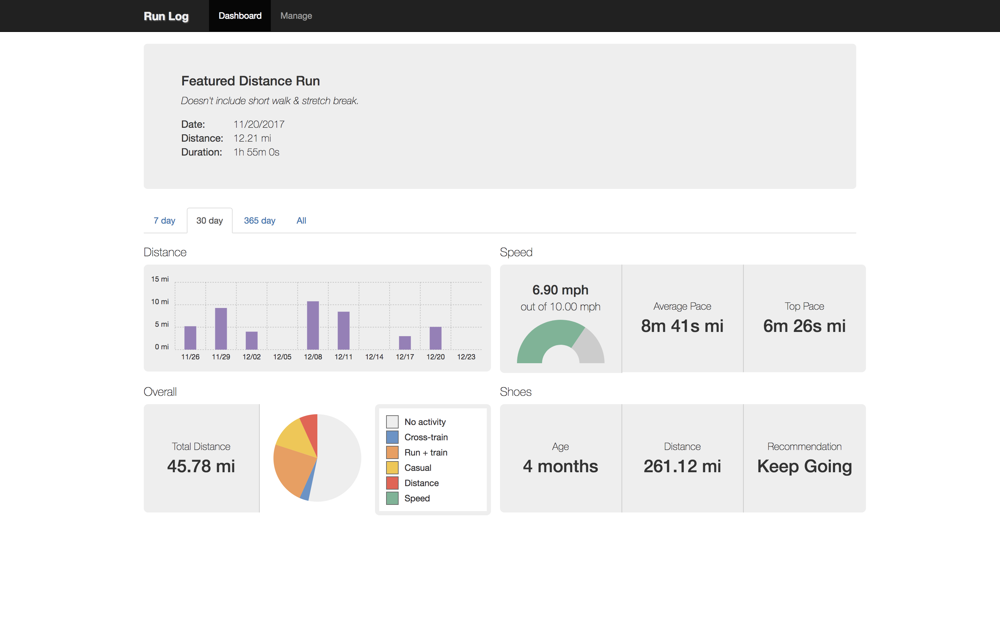
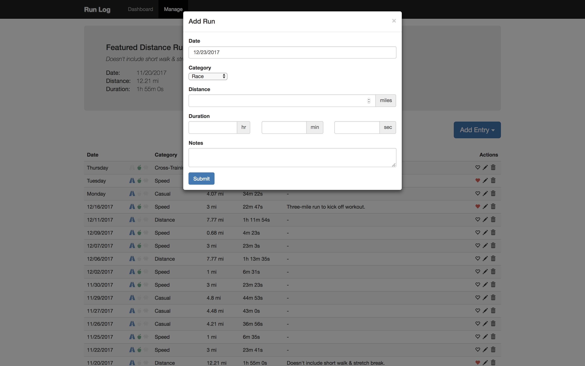

# Run Log

## Overview
Front-end application for logging runs and tracking progress.

See `src/sample-events.json` for the mock data that is loaded by default.

## Setup

```sh
$ yarn && yarn start
```

## Tests

```sh
$ yarn test
```

## Screenshots

### Login Screen

<figure>
  <kbd>
    
  </kbd>
  <figcaption>Use `demo`/`demo` to log in and view demo user data.</figcaption>
</figure>

### Dashboard

<figure>
  <kbd>
    
  </kbd>
  <figcaption>The dashboard with 30-day view loaded.</figcaption>
</figure>

### Manage Events

<figure>
  <kbd>
    
  </kbd>
  <figcaption>List of all events. You can add, edit, remove, and favorite events.</figcaption>
</figure>

### Add Event

<figure>
  <kbd>
    
  </kbd>
  <figcaption>To log a run, click on "Add Entry" and select "Run".</figcaption>
</figure>
